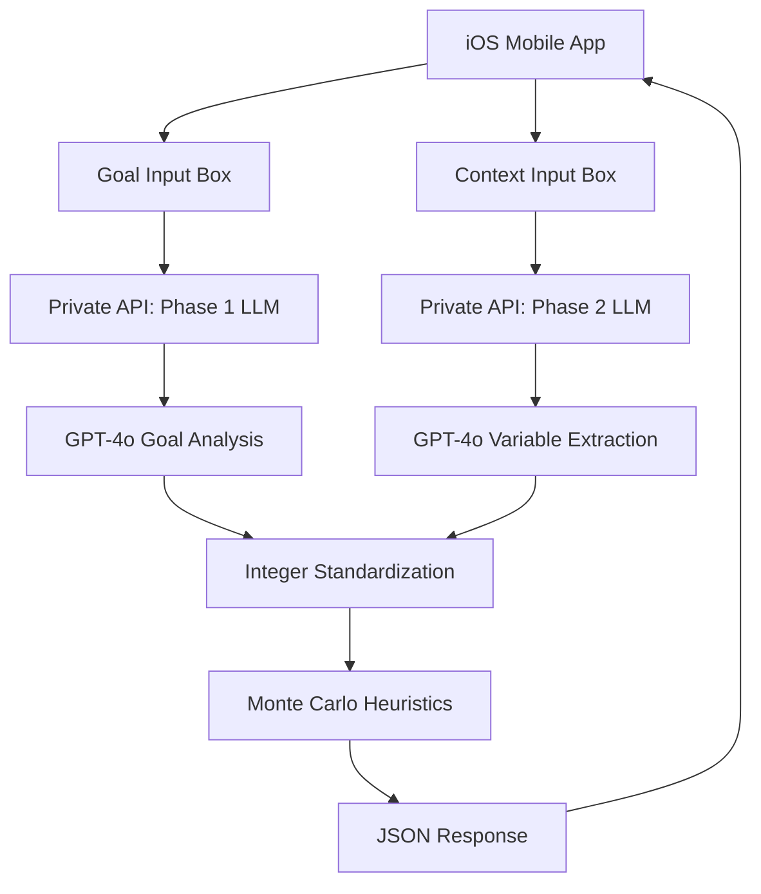

# MirrorOS Final - Master Context Document

**Complete system overview for the clean, LLM-powered MirrorOS architecture**

---

## 🏗️ **FINAL ARCHITECTURE OVERVIEW**

### **Repository Structure** 
```
MirrorOS Final System
├── MirrorOS-Final-Private/     🔒 Private (this repo)
│   ├── server.py               🚀 Flask API server with FRED integration
│   ├── lm_extractor.py         🤖 GPT-4o extraction system
│   ├── fred_integration.py     📈 FRED economic data integration
│   ├── buildspec.yml           🏗️ AWS CodeBuild configuration
│   ├── Dockerfile              🐳 AWS deployment
│   ├── .env                    🔐 Environment variables
│   └── requirements.txt        📦 Dependencies (includes fredapi)
│
└── MirrorOS-Final-Public/      🌐 Public (mobile repo)
    ├── MirrorOSApp.tsx         📱 React Native app
    ├── app.config.js           ⚙️ Expo configuration
    └── package.json            📦 Node dependencies
```

### **GitHub Repositories**
- **Private API**: `https://github.com/lbodkin223/productionprivateMirrorOS.git`
- **Public Mobile**: `https://github.com/lbodkin223/mirroros-final-public.git`

### **Clean Data Flow**


---

## 🔒 **PRIVATE REPOSITORY (mirroros-final-private)**

### **Core System: LLM Extraction Pipeline**

#### **Phase 1: Goal Analysis**
```python
# Input: Goal text from mobile app goal input box
goal_info = extract_goal_and_domain("What are odds I get job at OpenAI?")
# Output: {"goal": "get job at OpenAI", "domain": "career"}
```

#### **Phase 2: Variable Extraction**
```python  
# Input: Context text from mobile app context input box
var_info = extract_variables_and_categories("Work 4hrs/day, make $3k/week, Northwestern grad, age 23")
# Output: Variables categorized by: time, money, experience, demographic, target_entity
```

#### **Phase 3: Standardization**
```python
# Convert natural language to clean integers for heuristics
standardized = standardize_to_integers(variables, categories)
# Output: {hours_per_day: 4, income_weekly: 3000, education_score: 90, age: 23}
```

### **Technology Stack**
- **LLM Model**: GPT-4o (superior accuracy vs 3.5-turbo)
- **API Framework**: Flask (clean, lightweight)
- **LLM Integration**: Direct OpenAI API calls via requests
- **Deployment**: AWS ECS Fargate + Docker
- **Dependencies**: Minimal (flask, requests, python-dotenv)

### **Key Features**
- ✅ **No Legacy Code**: Completely rebuilt from scratch
- ✅ **GUI Separation**: Goal box → domain, Context box → variables
- ✅ **Direct API Calls**: No complex OpenAI library dependencies
- ✅ **Integer Output**: Clean data ready for monte carlo predictions
- ✅ **Error Handling**: Graceful degradation when LLM fails

### **Environment Variables** (AWS ECS)
```bash
OPENAI_API_KEY=sk-...
ANTHROPIC_API_KEY=sk-ant-...  # Backup LLM
FRED_API_KEY=3f4a3669dcef7d3509b06a2bde989993  # FRED Economic Data
FLASK_ENV=production
PORT=8080
HOST=0.0.0.0
```

---

## 🌐 **PUBLIC REPOSITORY (mirroros-final-public)**

**Location**: `/Users/liambodkin/Documents/MirrorOS-Final-Public/`
**GitHub**: `https://github.com/lbodkin223/mirroros-final-public.git`

### **Mobile Application Stack**
- **Framework**: React Native 0.79.6
- **Platform**: Expo 53.0.22
- **Language**: TypeScript
- **Deployment**: iOS App Store, Google Play Store

### **Key Components**
- `MirrorOSApp.tsx` - Main application interface
- `app.json` - Expo configuration
- `package.json` - Dependencies
- `.env.local` - Environment configuration

### **API Integration**
- Connects to private API via environment-configured endpoints
- Sends goal and context separately to different LLM phases
- Displays probability results with clean UI

### **Environment Configuration**
```bash
EXPO_PUBLIC_API_URL=https://api.mirroros.com
EXPO_PUBLIC_ENVIRONMENT=production
```

---

## ☁️ **AWS INFRASTRUCTURE - DEPLOYED**

### **Current Deployment Status**
- **✅ Repository**: `https://github.com/lbodkin223/productionprivateMirrorOS.git`
- **✅ ECS Cluster**: `mirroros-production-cluster`
- **✅ ECS Service**: `mirroros-private-api-service` 
- **✅ CodeBuild**: `mirroros-private-api-build`
- **✅ ECR Repository**: `423636639115.dkr.ecr.us-east-2.amazonaws.com/mirroros-private-api`
- **✅ API Gateway**: `https://yyk4197cr6.execute-api.us-east-2.amazonaws.com/prod/api`
- **✅ Load Balancer**: `mirroros-private-tg` target group

### **FRED Economic Integration**
- **✅ FRED API**: Live economic data integration
- **✅ Enhanced Predictions**: Economic context adjusts success probabilities
- **✅ New Endpoint**: `/economic-data` for direct economic indicators
- **✅ Dependencies**: fredapi==0.5.1 added to requirements.txt

### **Deployment Commands**
```bash
# Manual Docker deployment (when CodeBuild buildspec issues occur)
cd "/Users/liambodkin/Documents/MirrorOS-Production/MirrorOS-Final-Private"
aws ecr get-login-password --region us-east-2 | docker login --username AWS --password-stdin 423636639115.dkr.ecr.us-east-2.amazonaws.com
docker build -t mirroros-private-api-fred .
docker tag mirroros-private-api-fred:latest 423636639115.dkr.ecr.us-east-2.amazonaws.com/mirroros-private-api:latest
docker push 423636639115.dkr.ecr.us-east-2.amazonaws.com/mirroros-private-api:latest
aws ecs update-service --cluster mirroros-production-cluster --service mirroros-private-api-service --force-new-deployment

# Automatic CodeBuild deployment (when buildspec works)
aws codebuild start-build --project-name mirroros-private-api-build
```

### **Service Health Checks**
```bash
# Check ECS service status
aws ecs describe-services --cluster mirroros-production-cluster --services mirroros-private-api-service

# Check task health
aws elbv2 describe-target-health --target-group-arn arn:aws:elasticloadbalancing:us-east-2:423636639115:targetgroup/mirroros-private-tg/0cfd102ace7cae3d

# Test API (returns 401 - expected due to API Gateway auth)
curl https://yyk4197cr6.execute-api.us-east-2.amazonaws.com/prod/api/health
```

---

## 🚀 **CURRENT STATUS**

### **✅ Completed**
1. **Clean Architecture**: Two-repo separation (private/public)
2. **LLM System**: GPT-4o powered extraction pipeline
3. **Mobile App**: React Native app with environment configuration
4. **Docker Setup**: Production-ready containerization
5. **Git Repositories**: Initialized and committed

### **⚠️ Pending AWS Updates** 
1. **CodeBuild Source**: Update to mirroros-final-private repo
2. **Environment Variables**: Ensure OPENAI_API_KEY is configured
3. **ECS Service**: Point to new container image
4. **Testing**: Verify mobile app connects to updated API

### **🎯 Next Steps**
1. Update AWS CodeBuild project source repository
2. Deploy new container to ECS
3. Test mobile app with deployed API
4. Create GitHub repositories and push code
5. Update mobile app environment variables for production

---

## 🔧 **DEVELOPMENT WORKFLOW**

### **Local Development**
```bash
# Private API
cd /Users/liambodkin/Documents/MirrorOS-Final-Private
export OPENAI_API_KEY=your_key_here
python server.py

# Public Mobile
cd /Users/liambodkin/Documents/MirrorOS-Final-Public  
npm install
npx expo start
```

### **Production Deployment**
```bash
# 1. Push to GitHub
git push origin master

# 2. Trigger CodeBuild
aws codebuild start-build --project-name mirroros-final-private-build

# 3. Deploy to ECS
aws ecs update-service --cluster mirroros-production-cluster --service mirroros-final-private-service --force-new-deployment
```

---

## 📊 **SYSTEM BENEFITS**

### **Clean Architecture**
- **No Legacy Code**: Removed 2000+ line complex extractor
- **Simple Dependencies**: Just Flask, requests, python-dotenv
- **Clear Separation**: Private algorithms vs public interface

### **LLM-Powered Intelligence**
- **GPT-4o Accuracy**: Superior natural language understanding
- **Structured Output**: Clean integers for heuristics
- **Flexible Extraction**: Handles diverse goal/context combinations

### **Production Ready**
- **Docker Containerized**: Easy AWS deployment
- **Environment Configured**: Separate dev/prod settings
- **Scalable**: ECS Fargate auto-scaling ready

---

## 🛡️ **SECURITY CONSIDERATIONS**

### **Private Repository**
- **API Keys**: OpenAI and Anthropic credentials
- **Proprietary Logic**: LLM extraction algorithms
- **Business Intelligence**: Monte carlo heuristics

### **Public Repository** 
- **No Secrets**: Only public-facing mobile code
- **Environment Variables**: Non-sensitive configuration only
- **Open Source Ready**: MIT license compatible

---

*Last Updated: 2025-08-28 - MirrorOS Final Architecture*
*Next: AWS infrastructure updates and GitHub repository creation*